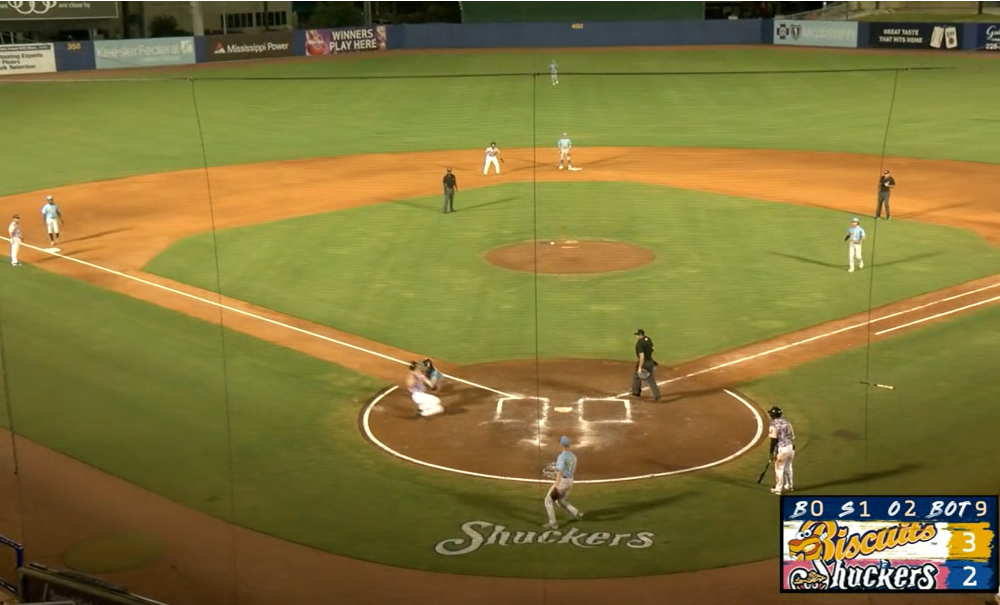
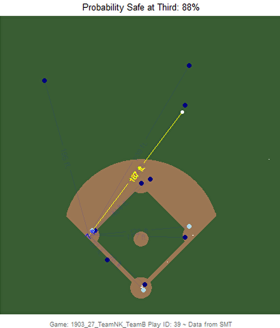
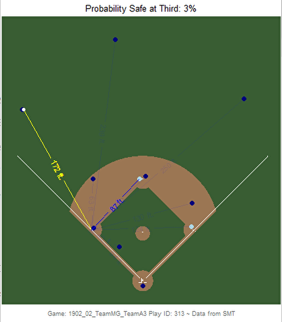
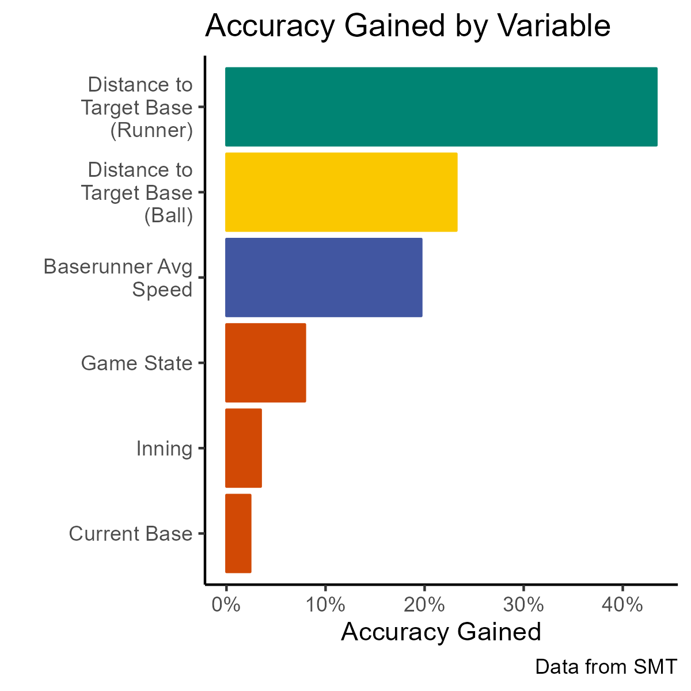
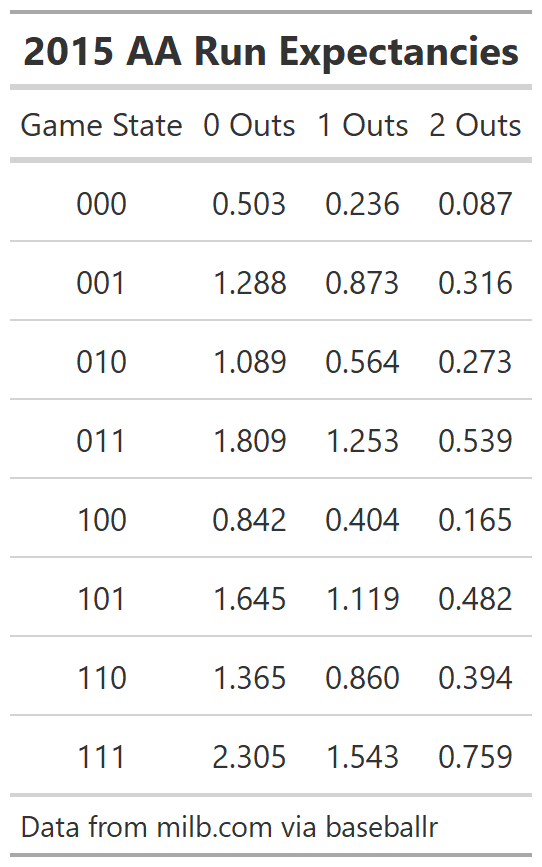
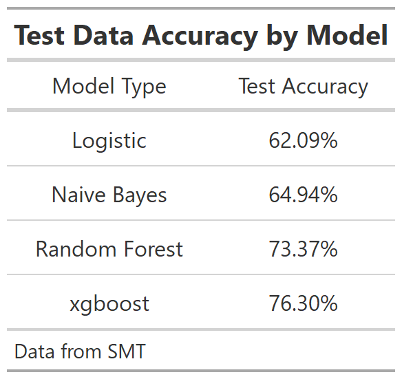

```{r setup, include=FALSE}
knitr::opts_chunk$set(echo = TRUE)
```

\newpage

# Introduction

|    With 2 outs in the bottom of the ninth, the Biloxi Shuckers (AA MIL) were batting down 1 to the Montgomery Biscuits (AA Rays) in a July game very important for the 2nd Half Divisional Title. With runners on first and second - both with decent speed - Thomas Dillard singled to right field. The runner on second was waved home and right fielder Kameron Misner's throw was on target to get the runner by two steps to end the game. The screenshot below is from MiLB TV.

```{r, echo=FALSE, out.width="90%", fig.align='center'}

```

|    In a sport where every game counts, that decision to send the runner could be what keeps Biloxi out of the playoffs. Why not hold the runner at third for a bases loaded situation? In my study, I created a model to evaluate these decisions - whether a runner should stay after advancing one base or attempt to advance two bases (first to third or second to home).

\newpage

# Four Factors

|    When I initially started with this idea, I determined four important factors that would be crucial to understanding these decisions: how far the ball is from the target base, how far the runner is from the target base, how fast the runner is, and what the game situation is. For this project, the target base is defined as exactly 2 bases ahead of where the runner initially starts. For a runner currently on first base this would be third and for a runner on second base, the target base would be home. The idea behind advancing 2 bases came from hearing broadcasters put special emphasis when a runner scored from second as opposed to a runner scoring off a sacrifice fly. Scoring off a deep sacrifice fly is usually seen as a given, so I wanted to evaluate something that required more skill by the baserunner.

### Factors 1 and 2: Distances to Target Base

|    As previously mentioned, the first factor for measuring if the runner will be able to successfully advance two bases is the distance between the ball and the target base. This calculation was simple - just a straight-line distance between the outfielder that threw the ball and the target base. However for the second factor - the distance between the runner and the target base - this was more complicated. Straight-line distance like I used for the ball would not work because baserunners need to touch all the bases. However, if I used a standard 180 feet for every baserunner, this would ignore any secondary lead or jump that the baserunner got on contact. I decided to mix these two strategies by doing a straight-line distance to the intermediate bag (second for the runner starting on first and third for the runner starting on second) and then add 90 feet to measure between the intermediate bag and the target base. Both of these distances were recorded at the time when the ball was thrown.

### Factor 3: Base Running Speed

|    The third factor is the speed of the base runner. For example, if Yankees outfield prospect Jasson Dominguez was running the bases, his chances of advancing 2 bases would be a lot higher than say Pirates catching prospect Henry Davis. With the tracking data available, I decided to measure each baserunner's average speed on the basepath as total distance covered divided by total time spent running. For this calculation, I filtered out plays where the baserunner ran less than 30 feet as these tended to be plays where the baserunner was waiting to see if he needed to tag up. This followed a bell curve with the exception of a few very extreme outliers. Since these were likely due to flaws in the data, those outliers were adjusted to be the speed of average runners.

### Factor 4: Game Information

|    The final factor I identified was game situation information. For this study, I included game state at the beginning of the play, the inning in which the play occurred, and the current base that the runner occupies (first or second). Game state is the combination of runners that are on base and the number of outs. For example, the game state for runners on second and third with 1 out would be "011, 1 out". The 0 in the first digit represents 0 runners on first, the 1 in the second digit represents 1 runner on 2nd, and likewise for 1 runner on third. Unfortunately, the number of outs on a given play was not in the dataset, an issue presented itself again later in the study. Knowing the game state is important, especially for runners on first, because a runner could take advantage of having runners ahead of him on the basepath. The current inning and the current base occupied were also included because coaches may be less likely to take risks late in a close game and may not want a runner thrown out at home.

### Factors for Future Consideration

|    If I had more time and data, there are a few other factors I would have liked to include. The first would be the number of outs. I presume coaches would not want to risk sending a runner with 2 outs when the runner could be held at third to score on a wild pitch or another hit. The next would be some type of arm metric that accounts for both strength and accuracy of the outfielder. Similar to how baserunners only steal on certain catchers, knowing who is throwing the ball in from the outfield is important for advancing bases too. I have seen this effect in several games I have watched when runners have been purposefully halted when the ball was hit to Brewers outfield prospect Joey Wiemer where they would have been sent against an outfielder with a weaker or less accurate arm.

|   With more data, I would have also gotten rid of fly outs. When an outfielder catches a fly ball it is basically impossible to advance multiple bases due to tagging up. There was not any information present in the data that would make it possible to exclude these plays. Finally, the score differential would be important to include. In blowouts, runners might be encouraged to show off their speed and take more risks since if they mess up the team was going to lose anyways. In contrast, for close games, teams tend to be more conservative.

\newpage

# How Safe or Out Data was Obtained

|    After identifying these factors, I began to filter down the number of plays that I studied in this analysis. I chose to filter down to plays where the ball was hit and only one outfielder touched the it. This means that plays with multiple overthrows or where the ball kicks off one glove far away from that fielder were excluded. From there, I filtered out plays with any missing information with the exception of missing inning. When a play had a missing inning, I just assumed it was the first inning which means that I assumed very little pressure of it being a close game with few innings left to play. Finally, as mentioned earlier, I filtered down to only runners that were only on first or second base. This left me with 779 observations. It is important to note that in some plays, there were runners on both first and second base on the same play. I counted these as separate observations, one for the runner on first and the other for the runner on second, since it is quite common that a runner scores from second but the runner from first got stopped at second.

|    The ideal way of measuring whether the runner advanced 2 bases or not would have been by looking at play by play information, but I was not given play by play data that corresponded to the tracking data. Play by play data for Minor League Baseball is available (and was utilized later), but I was unable to pair it with the tracking data given so I needed to come up with a new strategy. The next best option would be to compare game states between plays, but the data was missing in too many spots for this to be a viable option. So, I had to go with my last option: watch all the plays manually. I created GIFs similar to the screenshots below and manually tracked if the runner advanced 2 bases or not for all 779 plays. I gave the play the value of 1 if the runner successfully advanced 2 bases and a 0 if not. For runners on first that attempted to go home, they were still awarded a 1 because they successfully tagged third base and could have stopped if desired. Since this was tracked by hand, there could be human error that would be removed by using play by play information before this model is used.

{width="50%"} {width="50%"}

|    To see the actual plays unfold as a GIF (similar to how I watched them when labeling safe or out), click on [**this link**](https://github.com/billyfryer/stay-or-go/blob/main/Graphics/Stay-GIF.gif) for the first play where the runner chose to stay at second and [**this link**](https://github.com/billyfryer/stay-or-go/blob/main/Graphics/Go-GIF.gif) for the second play where the runner chose to advance to third. The second example is referenced throughout the paper as the "Go Example". As you watch the plays, the blue line between the runner and the target base always appears as a direct path, which does not include going through the intermediate base. However, the distance shown follows the definition laid out under Factors 1 and 2.

\newpage

# Modeling

|    From here I created my model to measure the probability that for a given play a runner is able to advance 2 bases. I decided between 4 different types of models and settled on the one with the best accuracy, an xgboost model with 76% accuracy. For more information about my model selection, see Appendix A. According to all models that I created, the distance between the base runner and the target bag was the most influential variable. This was followed by the distance between the thrower and the target base as well as the speed of the baserunner. The game situation variables such as game state, inning, or what base the runner started on had little effect on the model.

```{r, echo=FALSE, out.width="50%", fig.align='center'}

```

|    The plot labeled "Accuracy Gained by Variable" above shows just how much accuracy the model would lose by excluding that variable. For example, the distance between the baserunner and target base affected the accuracy of the model by an astounding 43%. In contrast, the exact base the runner starts on isn't nearly as important and only affected the model by 8%. This suggests that 3rd base coaches are close to equally likely to send a runner home as they are to signal one to come from first to third.

\newpage

# Applications

|    By itself, this model can be pretty useful. We now know for sure that the most important factors are the distance from the runner to the target base and the distance from the ball to the target base. These are easy checks that both the runner and coach can make on the fly when making a decision in game. We could expand on this idea and determine how much of an effect a faster pinch runner would have in increasing the chances that we advance 2 bases and potentially scoring in a close, late game situation. One drawback to this model right now is that we have very little context for what these probabilities mean. For example, if I have a 60% of advancing two bases, I don't know if that's good, bad, or most importantly worth the risk. To decide if the risk is worth taking, I decided to combine these probabilities with run expectancies.

# Run Expectancy

|    Run expectancies are the amount of runs that a team could expect for the rest of the inning based on the current game state. For example, a team has a higher run expectancy when the bases are loaded with 0 outs than with no one on and 2 outs.  I used the publicly available Minor League Baseball play by play information data to calculate run expectancies from the 2015 AA season which is shown in the chart below.

```{r, echo=FALSE, out.height="40%", fig.align='center'}

```

|    To read the above table, you pair up your Game State and the Number of Outs. For example, to find the expected number of runs at the beginning of an inning (no one on, no one out), you look for the row where Game State is 000 and then you move to the column where it says 0 outs. This value is 0.503 which means teams averaged 0.503 runs from this no one on, no one out situation across AA in 2015.

|    Because we were not given the exact classification or the years that the data set includes, I used 2015 AA to determine the run expectancy for this study. I have included the code to create these run expectancy tables which could be applied for the appropriate years and classifications after the data is desensitized. This could be filtered even further in high run scoring environments such as the High A California League or pitcher friendly leagues like the High A Florida State League.

|    The other issue that was present with the tracking data is that we did not have the number of outs for a given play. Because of this, for the rest of this paper when using the run expectancy table, I assumed that there was 1 out in all situations. It is important to note that this has no effect on the probability that the runner will advance two bases, only whether the risk is worth the possibility of another out. This assumption would not be needed if more data was provided.

### Applying Run Expectancies

|    Let's return to the Go Example from earlier. By using the Run Expectancies and the Stay or Go Model probabilities in tandem, we can determine whether or not to tell the runner to advance 2 bases. Our game state before the play is "100" because the only runner on was on first base and we assume that there was 1 out. From the model, the probability that the runner would be safe at 3rd base is 88%. Now let's look at the possible outcomes. If the runner decides to try and advance 2 bases, this means our possible game states after the throw are "101, 1 out" if the runner is safe or "100, 2 outs" if the runner is thrown out. If the runner decides not to attempt to take third, the game state will be "110, 1 out". We cover the math more completely in Appendix B, but by combining this information, the difference in run expectancy from attempting to take the base compared to staying at second is 0.145. This means that the decision to go for third will gain the team 0.145 in run expectancy by the runner attempting to advance to third base. This means that the risk is definitely worth taking and the runner should be signlaed on to third base.

|    One advantage to this converting to the run expectancies is that similar metrics exist in other sports already. For example, in football there is a lot of discussion about whether to go for a fourth down conversion or punt the ball away and how this affects win probability added. By converting to units that are more familiar, it helps everyone understand exactly what is good or bad.

\newpage

# Final Takeaways

|    When combined with run expectancy, this metric can be used in a variety of different way. One example would be a team using it to evaluate which other teams are riskier on the base paths. If a fielder knows a runner likely won't try to go from second to home, he can take more time to make an accurate throw to the infield rather than risk a wild throw to the plate. This could also be used self reflectively to see if a team should be more passive or more aggressive with their own advancing of bases. By reflecting, teams would cut down on some unforced errors like the example of the Biloxi Shuckers at the beginning of this paper and potentially cause more chaotic plays by the opposing defense.

|    I imagine the future of this or a similar metric in chart form for coaches to wear on their wrist for each base runner. This would be similar to how fielders have positioning cards in their pocket for the shift per batter. When a runner is on base, the coach checks their card for when to give the runner the green light.

|    This also has applications outside of team strategy. As someone with past umpiring experience, knowing which teams are more aggressive on the basepaths is important to make sure you can be in the best possible position to make the right call. If one team, or even individual player is known to be more aggressive, then the other umpires can be able to give the umpire that makes the call extra backup if a challenge occurs.

\newpage

# Appendix A: Modeling Expanded

|    Because I wanted to model probabilities, I knew I need some type of a classification model. So I considered 4 different types of models when performing this analysis: a logistic regression model, a naive bayes classifier, a random forest, and an xgboost model. I trained each model on a training data set containing 60% of the data from the 779 plays, leaving the other 40% for later testing. All numeric variables were centered and scaled before analysis. For the random forest model, I grew 100 trees. For the xgboost model, I converted Game State from a factor variable to be a series of indicator variables to meet the requirement of only numeric values in the xgboost model. I only did 10 rounds of boosting in the xgboost model and did not tune the model afterwards. After modeling, I selected the model based on the accuracy of the predictions on the test set shown below. The xgboost model had the highest classification accuracy on the test set as well as a logloss of 0.290046. With further model tuning, I am sure the accuracy would increase and the logloss could decrease dramatically. For the accuracy gained chart in the Modeling section of this paper, I combined the accuracy gained for each game state into 1 value for visualization sake.

```{r, echo=FALSE, out.height="40%", fig.align='center'}

```

\newpage

# Appendix B: Converting Advance 2 Bases Probabilities to Run Expectancy

To calculate the change in run expectancy, the following formula is used:

<br> **[RE(Success) x Pr(Success) + RE(Failure) x (1-Pr(Success))] - RE(No Attempt)**

where **RE()** is the run expectancy of a given game state and **Pr(Success)** is the probability of advancing 2 bases as given by the model.

|    The first half of this formula gives the expected run expectancy given that the runner attempts to advance to the target base. The second half of the formula (**RE(No Attempt)**) is the run expectancy given the runner stops at the intermediate base. This helps determine if the reward of the risk is worth more than staying put. Let's work out an example together - the Go Example. As stated previously, our game state before the play is "100" because the only runner on was on first base and we assume that there was 1 out. From the model, the probability that the runner would be safe at 3rd base is 88%. Now let's look at the possible outcomes. If the runner decides to try and advance 2 bases, this means our possible game states after the throw are "101, 1 out" if the runner is safe or "100, 2 outs" if the runner is thrown out. If the runner decides not to attempt to take third, the games state will be "110, 1 out". If the information is plugged into the formula, it looks like this.

<br> **[RE(101, 1 out) x (0.88) + RE(100, 2 outs) x (1-0.88)] - RE(110, 1 out)**

The run expectancy table is used to evaluate the last three missing pieces of information. The formula then reduces to:

<br> **[(1.119 x 0.88) + (0.165 x 0.12)] - 0.860 = 0.14452**

|    Since this value is positive, this means that the risk is worth taking and the runner should attempt to advance to third. It is important to remember that the number of outs plays an important role as well. For example, let's reimagine this scenario with two outs. The formula would look like this:

<br> **[RE(101, 2 outs) x (0.88) + RE(3 outs) x (1-0.88)] - RE(101, 2 outs)**

Because when there are 3 outs the team switches from offense to defense, the run expectancy when there are 3 outs is always 0.

<br> **[(0.482 x 0.88) + 0] - 0.394 = 0.03016**

Although the value is still positive, it is much closer to 0. This means that the risk is very high but still worth taking.
